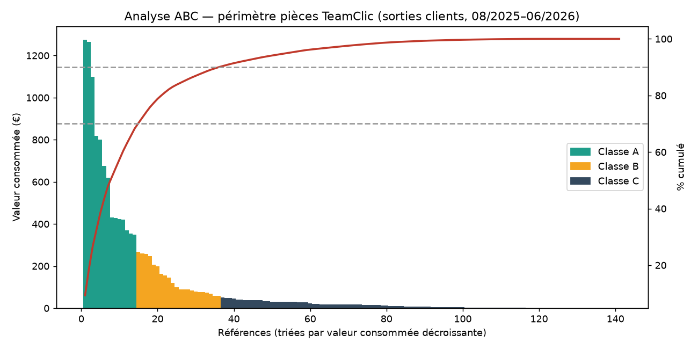

# Copilote IA de réapprovisionnement prédictif — POC TeamClic

Preuve de concept réalisée dans le cadre du devoir final **« L'IA au service de la Supply Chain »** (LSI3 — ESLI / GIP CEI), par **Fanny GOYET**.

Dépôt : https://github.com/fannygoyet/copilote-ia-reappro-teamclic

Le POC prolonge mon PFE chez **TeamClic** (réseau de réparation de smartphones) : là où mon PFE avait mis en place une automatisation du réappro par **règles figées** (seuils mini/maxi Odoo), ce POC explore l'étape suivante — une **classification intelligente** des références qui adapte la gestion de stock à la valeur *et* à la prévisibilité de chaque pièce.

## Ce que fait le script

À partir des exports Odoo (catalogue + mouvements de stock), [`analyse_abc_xyz.py`](analyse_abc_xyz.py) produit en quelques secondes :

1. **Classification ABC** sur la valeur consommée (seuils Camelot/Lemaire 70/20/10).
2. **Classification XYZ** sur la régularité de la demande (coefficient de variation, calculé sur les 9 mois pleins uniquement).
3. **Stock de sécurité dynamique** `SS = k × σ` (table de Mercier : k = 1,28 / 1,65 / 2,33 selon X/Y/Z), calculé **uniquement pour les références stockées** (classes A et B).
4. **Point de commande** par référence.
5. **ROI de portage** : coût immobilisé évité en sortant les références CZ (faible valeur + sporadiques) du réappro automatique.
6. Un **rapport Excel à 3 onglets** (Synthèse / Recommandations / À fiabiliser) directement lisible par la direction.

## Résultat clé



Sur le périmètre testé (141 références, 11 mois) : **14 références concentrent 68 % de la valeur consommée**, et **seules 2 références sur 141 atteignent une demande régulière**. Conclusion défendable par la donnée : des seuils mini/maxi *fixes et identiques* pour toutes les références sont structurellement inadaptés.

## Lancer le POC

```bash
pip install -r requirements.txt
python3 analyse_abc_xyz.py
```

Le script attend deux exports Odoo dans le même dossier :

- `Catalogue_pieces.xlsx` — catalogue + prix + coûts + quantités en stock
- `Mouvements_pieces.xlsx` — mouvements de stock datés

## Données

> ⚠️ **Les données réelles ne sont pas incluses dans ce dépôt.** Les exports Odoo et les fichiers de sortie contiennent des informations confidentielles de TeamClic (coûts d'achat, références, noms de tiers). Conformément au cadre RGPD / NDA du projet, ils sont exclus via [`.gitignore`](.gitignore). Seul le code est partagé.

## Stack

Python 3 · pandas · numpy · openpyxl

## Méthodes mobilisées

Classification ABC/XYZ · stock de sécurité dynamique (k×σ) · analyse de Pareto · IA générative (Claude/ChatGPT) pour l'analyse des exports et la génération des recommandations. Architecture cible (non implémentée dans le POC) : connexion temps réel à Odoo via MCP.
